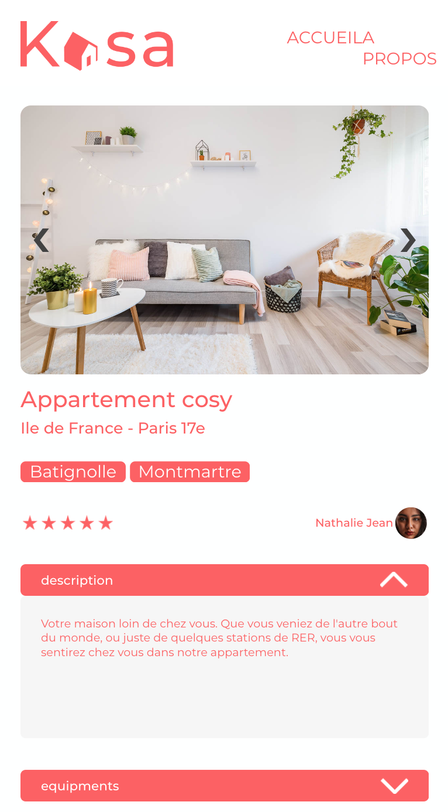

### Kasa, home anywhere
### B&B application
---

https://kasa-myhomeanywhere.herokuapp.com/

---
<p align="center">
    
</p>

---
### Stack
- React 17
- Sass

### Tools
- Figma


---
### Install & run
```bash
$ git clone https://github.com/GitHubAgneska/HAgnesGenay_3_19112020.git

$ npm install
$ npm run start
```

---
### Note
There's a Kasa version that runs with Express (for deployment with api)
=> see repository: https://github.com/GitHubAgneska/KASA

---
